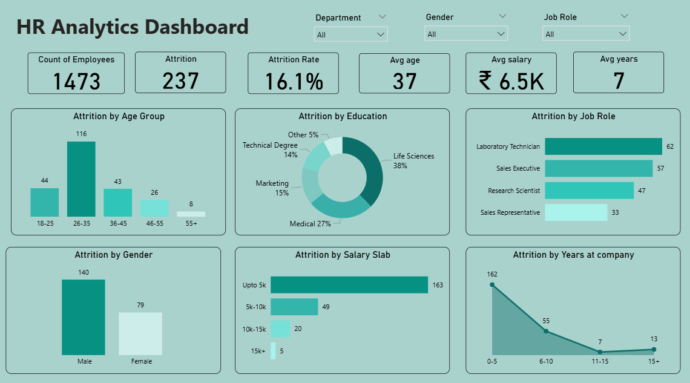

# HR-Dashboard
##1. Project Title / Headline

HR Analytics Dashboard – Employee Attrition Analysis

An interactive dashboard that analyzes employee attrition, workforce demographics, and salary distribution to understand employee turnover trends.

##2. Short Description / Purpose

This Power BI dashboard provides insights into employee attrition across different departments, job roles, age groups, and salary levels. It helps HR teams identify patterns and factors that contribute to employee turnover.

##3. Data Source

Dataset: HR Employee Attrition Dataset

###The dataset includes information about:

-Employee demographics 

-Department and job roles

-Salary and salary slabs

-Years at company

-Employee attrition status

##4. Features / Highlights
###Business Problem

Organizations often struggle to understand why employees leave and which groups have the highest attrition.

###Goal of the Dashboard

To provide an interactive visualization tool that helps HR teams monitor attrition trends and analyze workforce data.

###Key Visuals

-KPI Cards 

-Attrition by Age Group

-Attrition by Education

-Attrition by Job Role

-Attrition by Gender

-Attrition by Salary Slab

-Attrition by Years at Company

##5. Insights

-The 26–35 age group has the highest employee attrition.

-Employees in lower salary slabs show higher attrition.

-Certain job roles such as Laboratory Technician and Sales Executive experience higher turnover.

##6.Screenshoot

